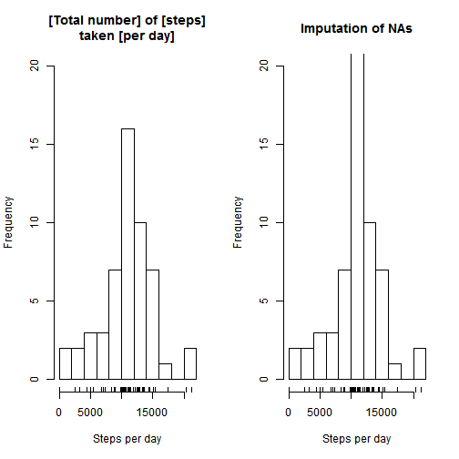

# Reproducible Research: Peer Assessment 1
Generated via knir @ 2015-03-16 02:14:20 Australia/Sydney

## Loading, describing and pre-processing the data

### Load the data from *activity.csv*


```r
activity.df <- read.csv( "activity.csv", colClasses = c("integer", "Date", "factor"), stringsAsFactors = FALSE )
```

### Describing the dataset

Sneak peek of the data:

```r
head(activity.df)
```

```
##   steps       date interval
## 1    NA 2012-10-01        0
## 2    NA 2012-10-01        5
## 3    NA 2012-10-01       10
## 4    NA 2012-10-01       15
## 5    NA 2012-10-01       20
## 6    NA 2012-10-01       25
```

Number of observations:

```r
dim(activity.df)
```

```
## [1] 17568     3
```

Number of dimensions:

```r
colnames(activity.df)
```

```
## [1] "steps"    "date"     "interval"
```

Verify the existency of NAs (missing data) per column:

```r
colSums( is.na( activity.df ) )
```

```
##    steps     date interval 
##     2304        0        0
```

Overview of the data:

```r
summary(activity.df)
```

```
##      steps             date               interval    
##  Min.   :  0.00   Min.   :2012-10-01   0      :   61  
##  1st Qu.:  0.00   1st Qu.:2012-10-16   10     :   61  
##  Median :  0.00   Median :2012-10-31   100    :   61  
##  Mean   : 37.38   Mean   :2012-10-31   1000   :   61  
##  3rd Qu.: 12.00   3rd Qu.:2012-11-15   1005   :   61  
##  Max.   :806.00   Max.   :2012-11-30   1010   :   61  
##  NA's   :2304                          (Other):17202
```

### Pre-process/transform the data

Remove NAs (missing data):

```r
activity.noNAs.df <- na.omit(activity.df)
#rownames(activity.noNAs.df) <- NULL
```

Sneak peek of the data without NAs (missing values):

```r
head(activity.noNAs.df)
```

```
##     steps       date interval
## 289     0 2012-10-02        0
## 290     0 2012-10-02        5
## 291     0 2012-10-02       10
## 292     0 2012-10-02       15
## 293     0 2012-10-02       20
## 294     0 2012-10-02       25
```

Number of observations (originally 17568 rows):

```r
dim(activity.noNAs.df)
```

```
## [1] 15264     3
```

Overview of the data:

```r
summary(activity.noNAs.df)
```

```
##      steps             date               interval    
##  Min.   :  0.00   Min.   :2012-10-02   0      :   53  
##  1st Qu.:  0.00   1st Qu.:2012-10-16   10     :   53  
##  Median :  0.00   Median :2012-10-29   100    :   53  
##  Mean   : 37.38   Mean   :2012-10-30   1000   :   53  
##  3rd Qu.: 12.00   3rd Qu.:2012-11-16   1005   :   53  
##  Max.   :806.00   Max.   :2012-11-29   1010   :   53  
##                                        (Other):14946
```


## What is [mean total number] of [steps] taken [per day]?
For this part, the [missing values] in the dataset will be [ignored].

Calculate the [total number of steps] taken [per day]:

```r
total.steps.per_day <- tapply( activity.noNAs.df$steps, activity.noNAs.df$date, sum )
```

Histogram of the [total number of steps] taken [each day]:

```r
hist( total.steps.per_day
    , breaks = 15
    , xlab="Steps per day"
    , ylab="Frequency"
    , ylim = c( 0, 20 )
    , main="[Total number] of [steps] taken [per day]"
)
rug( total.steps.per_day )
```

 

[Mean] of the [total number of steps] taken [per day]:

```r
steps.mean.per_day <- mean( total.steps.per_day )
steps.mean.per_day
```

```
## [1] 10766.19
```

[Median] of the [total number of steps] taken [per day]:

```r
median.steps.per_day <- median( total.steps.per_day )
median.steps.per_day
```

```
## [1] 10765
```


## What is the [average] [daily activity] pattern?

Make a [time series] plot (i.e. type = "l") of the [5-minute] interval (x-axis) and the [average number of steps] taken, [averaged across] all days (y-axis).


```r
avg.steps.df <- aggregate( activity.noNAs.df$steps
                         , list( interval = as.numeric( as.character( activity.noNAs.df$interval ) ) )
                         , FUN = mean 
                         )
colnames( avg.steps.df ) <- c("interval","steps.mean")
plot( avg.steps.df , type = "l"
    , xlab="[5-minute] interval"
    , ylab="Steps"
    , main = "[Mean] number of [Steps] by [Interval]"
    )
```

 

Which [5-minute interval], on [average across all the days] in the dataset, contains the [maximum number of steps]?


```r
avg.steps.df[ avg.steps.df$steps.mean== max( avg.steps.df$steps.mean) , ]
```

```
##     interval steps.mean
## 104      835   206.1698
```


## Imputing missing values

The presence of [missing data] values may introduce bias into some calculations or summaries of the data.

Calculate and report the [total number of missing values] in the dataset (i.e. the total number of rows with `NA`s):

```r
colSums( is.na( activity.df ) )
```

```
##    steps     date interval 
##     2304        0        0
```

The work-around is the imputation of the [mean for that 5-minutes interval] to replace all [NA] value in the [steps column].

Create a new dataset that is equal to the original dataset but with the [missing data filled] in

```r
imputation.df <- activity.df 
for( idx in 1:nrow( imputation.df ) ) {
  if( is.na( imputation.df$steps[ idx ] ) ) {
     imputation.df$steps[ idx ] <- avg.steps.df$steps.mean[ avg.steps.df$interval==imputation.df$interval[ idx ] ]
  }
}
new.steps.per_day <- tapply( imputation.df$steps, imputation.df$date, sum )
```


Make a histogram of the [total number of steps] taken [each day].

```r
par( mfrow=c(1,2) )
hist( total.steps.per_day
    , breaks = 15
    , xlab="Steps per day"
    , ylab="Frequency"
    , ylim = c( 0, 20 )
    , main="[Total number] of [steps]\ntaken [per day]"
)
rug( total.steps.per_day )
hist( new.steps.per_day
    , breaks = 15
    , xlab="Steps per day"
    , ylab="Frequency"
    , ylim = c( 0, 20 )
    , main="Imputation of NAs"
)
rug(new.steps.per_day)
```

 

After recalculate [mean] and [median] of the [total number of steps] taken [per day] (imputation of missing data),
verify what is the [impact] of the [imputation of missing data] on the estimates of the [total daily number of steps]?


```r
newtot.steps <- tapply( imputation.df$steps , imputation.df$date , FUN = sum )
newmean <- mean( newtot.steps )
newmedian <- median( newtot.steps )
data.frame( Mean=c(steps.mean.per_day, newmean, abs(steps.mean.per_day-newmean))
          , Median=c(median.steps.per_day , newmedian , abs(median.steps.per_day-newmedian))
          , row.names=c("Original","Imputation", "Difference" )
          )
```

```
##                Mean       Median
## Original   10766.19 10765.000000
## Imputation 10766.19 10766.188679
## Difference     0.00     1.188679
```

**There is no change to the [mean], however the new [median] calculated with [imputation of the missing data] is higher.**

## Are there differences in activity patterns between [weekdays] and [weekends]?

Create a new factor variable in the dataset with two levels: [weekday] and [weekend] indicating whether a given [date] is a [week day] or [weekend day]:

```r
imputation.df$weekdays <- factor( format( imputation.df$date , "%A" ) )
levels(imputation.df$weekdays) <- list( weekday = c("Monday", "Tuesday"
                                                   , "Wednesday", "Thursday"
                                                   , "Friday"
                                                   )
                                      , weekend = c("Saturday", "Sunday" ) 
                                      )
table(imputation.df$weekdays)
```

```
## 
## weekday weekend 
##   12960    4608
```

Panel plot containing a [time series plot] (i.e. type = "l") of the [5-minute interval] (x-axis) and the [average number of steps] taken, [averaged across] all [weekday days] or [weekend days] (y-axis). 

```r
library( ggplot2 )
newavg.steps.df <- aggregate( imputation.df$steps
                         , list( interval = as.numeric( as.character( imputation.df$interval ) )
                               , weekdays = imputation.df$weekdays )
                         , FUN = mean )
colnames( newavg.steps.df )[3] <-"steps.mean"

ggplot( newavg.steps.df, aes( interval, steps.mean ) ) +
        geom_line( color = "blue", size = 0.7)         +
        facet_wrap( ~ weekdays , ncol = 1 )            +
        labs( title = "Time series plot of the [5-minute interval]"
            , x = "Interval"
            , y = "Number of steps" )
```

 
